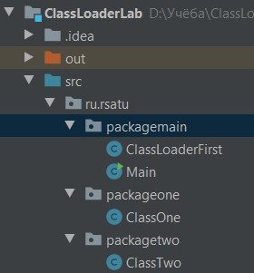
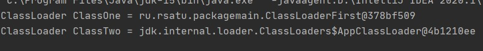

= Отчет по лабораторной работе 5
Студентов группы ПИМ-21 Бубенцова С.А. Носкова И.А.
:figure-caption: Рисунок
:listing-caption: Листинг
:source-highlighter: coderay

== 1 Постановка задачи

В процессе выполнения лабораторной работы необходимо выполнить следующие задачи:

. ознакомится с руководством по загрузке классов и ClassLoader;
. продемонстрировать работу своего загрузчика классов;
. определить разницу между своей и стандартной реализацией.

== 2 Выполнение

=== 2.1 Структура проекта

Структура проекта по созданию собственного загрузчика классов представлена ниже.

.Структура проекта

=== 2.2 Задание

Для демонстрации работы собственного загрузчика классов, были разработаны два класса - ClassOne и ClassTwo. ClassOne - загружается, используя собственный загрузчик классов, ClassTwo - загружается, использую стандартный загрузчик классов.

.Листинг ClassOne
[source, java]
----
package ru.rsatu.packageone;

public class ClassOne {

    public String printStr() {
        return "ClassOne";
    }
}

----

.Листинг ClassTwo
[source, java]
----
package ru.rsatu.packagetwo;

public class ClassTwo {

    public String printStr() {
        return "ClassTwo";
    }
}

----
Собственный загрузчик классов имеет:

. метод loadclassdata - метод будет считывать файл класса из файловой системы;
. метод findClass - находит класс с указанным именем;
. конструктор, который принимает на вход путь до искомого класса.

.Листинг загрузчика классов
[source, java]
----
package ru.rsatu.packagemain;

import java.io.File;
import java.io.FileInputStream;
import java.io.FileNotFoundException;
import java.io.IOException;
import java.io.InputStream;
import java.nio.ByteBuffer;
import java.util.HashMap;

public class ClassLoaderFirst extends ClassLoader {
    private final HashMap<String, Class<?> > cash;
    private String pathToClasses = "";
    
    ClassLoaderFirst(String path) {
        cash = new HashMap<>();
        pathToClasses = path;
    }
    
    @Override
    public Class<?> findClass(String name) {
        if (cash.containsKey(name))
            return cash.get(name);
        File classFile = new File(pathToClasses + name.replace('.', '/') + ".class");
        if (!classFile.exists() | !classFile.canRead())
            try {
                throw new FileNotFoundException();
            } catch (FileNotFoundException e) {
                e.printStackTrace();
            }

        InputStream classFileStream = null;
        try {
            classFileStream = new FileInputStream(classFile);
        } catch (FileNotFoundException e) {
            e.printStackTrace();
        }
        try {
            loadClassData(name, classFileStream);
        } catch (IOException e) {
            e.printStackTrace();
        }

        return cash.get(name);
    }   
    
    private void loadClassData(String name, InputStream classFileStream) throws IOException {        
        ByteBuffer b = ByteBuffer.wrap(classFileStream.readAllBytes());
        cash.put(name, defineClass(name, b, null));
    }   
}
----

== 3 Результаты выполнения

Были загружены два класса. Названия загрузчиков выводились в консоль.

.Результат

Разница между своей и стандартной реализацией:

. возможность динамически загружать файлы из локальной файловой системы или
полученные во время выполнения;
. можно полностью контролировать процесс загрузки абсолютно всех Java-классов;
. нельзя сделать с помощью ClassLoader новый класс, не располагая его байт-кодом.

== Вывод

В результате выполнения лабораторной работы была изучена технология загрузки Java
классов и продемонстрирована работа своего загрузчика классов, также была определена
разница между своей и стандартной реализацией. Все поставленные задачи были успешно
решены.